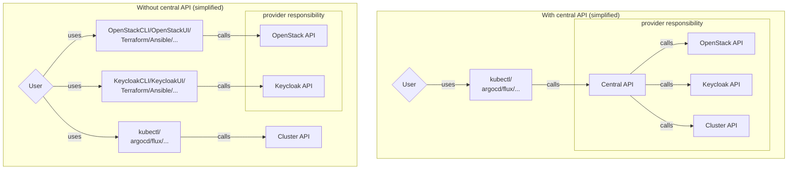

# Overview

## Premise

By embracing existing open source solutions and bundling them, SCS provides a viable
alternative to widely adopted proprietary cloud offerings, including
Infrastructure-as-a-Service offerings, Kubernetes-as-a-Service offerings and other
X-as-a-Service offerings.

The choice to embrace existing technology has huge advantages over starting from
scratch.
By not reinventing wheels, a lot of effort is saved and existing communities are
strengthened. The adoption of existing open standards is supported, reducing
market fragmentation and increasing interoperability.

## Challenge

The challenge: Using popular open source components at cloud service providers
does not result in a consistent experience for their users, yet.

Each part of the stack is consistent within its own scope: E.g. The
[OpenStack Networking API](https://docs.openstack.org/api-ref/network/v2/) is sort of
consistent with the
[OpenStack Load Balancer API](https://docs.openstack.org/api-ref/load-balancer/v2/).

The OpenStack API's share API idioms like the used AuthN/AuthZ
(Authentication/Authorization) mechanisms. But these are not applicable beyond
OpenStack services.

Entering general IAM (Identity and Access Management), Keycloak has its own set of
API endpoints and authentication flows.
Entering Kubernetes, CAPI ([Kubernetes Cluster API](https://cluster-api.sigs.k8s.io/))
uses the Kubernetes API with its own authentication configuration, RBAC (Role Based
Access Control) and opinionated resource management idioms.

So, without a central API harmonizing at least the semantics of AuthN/AuthZ and
resource management, users are left with a bunch of semantically incompatible API's.
If resources in different API's are somehow interconnected, the users have to take
care of bridging these differences themselves.

Providing a consistent API across many different offerings with sort of consistent
API idioms is something that primarily the big proprietary cloud providers manage to
do. And while that serves users well in that regard, it also serves as an effective
vendor lock-in feature.

## The chosen approach to pursue

Goal: **Provide a "semantically" consistent API modelling most cloud resources
that are in scope for SCS**.

In other words: Bring each cloud resource type - as it is - into the central API.

An `OpenStack Compute Instance` continues to be as-is with all of its usual
properties and implementation details.
A `Keycloak Realm` continues to be as-is with all of its usual properties
and implementation details.

That is not to say that abstractions are absolutely not planned as further steps.
There were discussions happening about that already: Regarding IAM management [^1]
and Kubernetes management [^2].

However, the **main** benefit is that all offered API objects can be managed
using the same API idioms (AuthN/AuthZ/REST) with the same client tooling [^3].

[^1]: There were discussions to build a generic SCS API to support
SCS installations powered by Zitadel. Approaching the issue a little
bit like the "Abstract all the things!" consideration above, but focusing
on two basic use cases (Firstly, setting up an identity federation to some
existing identity provider; Secondly, managing users without remote identity
provider). While not in scope for the first steps, this probably could be
elegantly implemented as one generic Crossplane "Composite Resource Definition"
backed by a Crossplane "Composition" defining either Keycloak objects OR
Zitadel objects (given that Zitadel gets a Crossplane provider or a similar
Kubernetes controller before).

[^2]: In order to cover providers that use Gardnener, a generic Crossplane
"Composite Resource Definition" like in [^1] may be created. Alternatively,
Gardnener CRD's could maybe just be mirrored in their Central API instance,
still creating an interoperability benefit through "semantic" compatibility.

[^3]: Which is also not to say that it will be suggested to providers to disable
their public OpenStack/Keycloak/... API's, preventing use of native
OpenStack/Keycloak/... tooling and breaking existing solutions.
Extensively using these API's together with the central API may compromise
the benefits of its uniform AuthZ, though.

### Kubernetes API

Instead of creating SCS-specific API idioms and building the implementation
from scratch, the Kubernetes API will be "reused". Essentially, the Kubernetes
API is just an opinionated REST API which has opinions on how a resource
is defined, how it looks like, how it is reconciled/handled, how AuthN/AuthZ
can be implemented. The Kubernetes ecosystem provides much tooling for working
with such (custom) resource definitions: For creating the definitions
themselves, building controllers, making them discoverable and deployable.

As such, Kubernetes is a great choice for building any sort of resource
management API - with some caveats regarding its deployment and the legacy
of starting off as container orchestration tooling.

### Crossplane tooling

Crossplane even extends the Kubernetes API with
"[Compositions](https://docs.crossplane.io/v1.14/concepts/compositions/)" and
"[Composite Resource Definitions](https://docs.crossplane.io/v1.14/concepts/composite-resource-definitions/)"
(XRD) to make Kubernetes the base for platform engineering within organizations.

Secondly, it provides an API machinery to bring any cloud resource into Kubernetes
using backend-specific "providers" (roughly comparable with Terraform providers).
As such, Crossplane with its provider ecosystem actually already did most of
the heavy lifting for providing e.g. OpenStack or Keycloak resources inside of Kubernetes.

On top, the platform engineering concepts in Crossplane make building multi-tenancy
systems pretty straight-forward, even for
[single clusters](https://docs.crossplane.io/knowledge-base/guides/multi-tenant/#single-cluster-multi-tenancy).

Alright. Crossplane takes care of exposing OpenStack resources and does some
fancy stuff regarding multi-tenancy. What about providing actual Kubernetes
**workload** clusters?

### Cluster stacks / Cluster API

[Cluster stacks](https://github.com/SovereignCloudStack/cluster-stacks) do
[not replace the use of Cluster API](https://github.com/SovereignCloudStack/cluster-stack-operator/blob/adb648ceaebddca04a015fbea0319110ca99a5cc/docs/architecture/user-flow.md#recap---how-do-cluster-api-and-cluster-stacks-work-together).
Instead, they are complementing Cluster API by providing `ClusterClasses`, node
images (if required) and workload cluster addons.

It is still to be determined how to bring multi-tenancy concepts from Crossplane
into ClusterStacks/CAPI, if even required.

Should the provider be responsible for creating `ClusterClasses`?
If yes, enforcing some parameters inside via a `ClusterClass` may be enough
to provide multi-tenancy, already. That is to be determined, though.

## Implementation

Disregarding any potential further abstractions, most work in automation for
the providers will be about installing the central API and securely distributing
credentials for backing services like OpenStack or Keycloak.
For that, there is no production implementation yet. See
[the POC for inspiration](./poc-setup.md) for now. It includes access to an OpenStack API
through Kubernetes/Crossplane.
