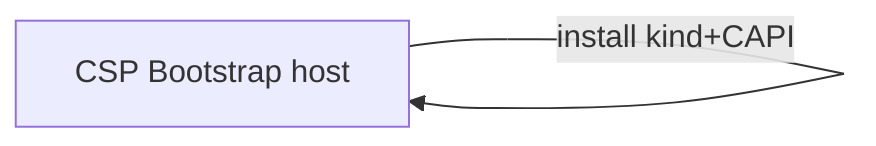
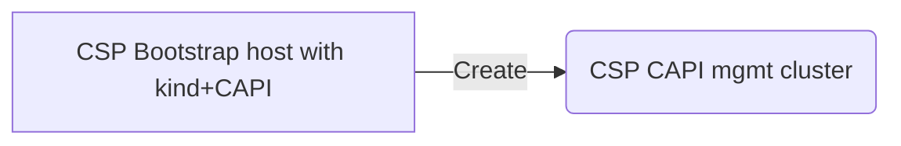
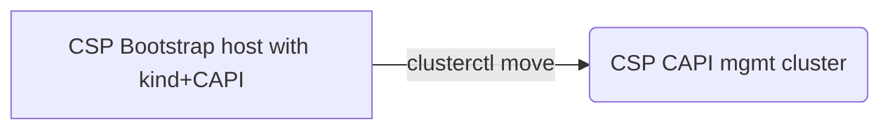
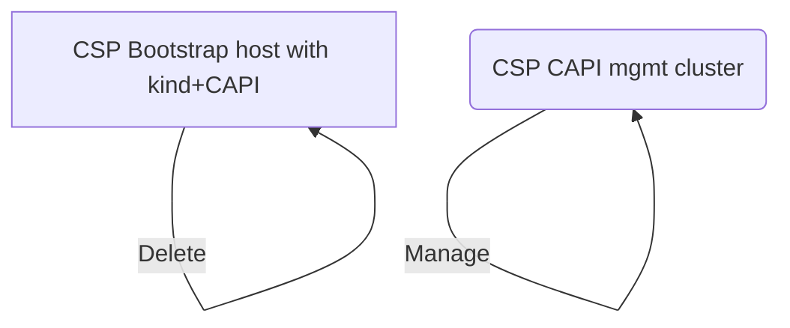
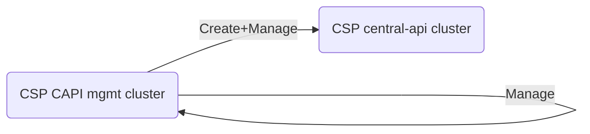
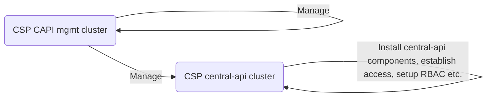
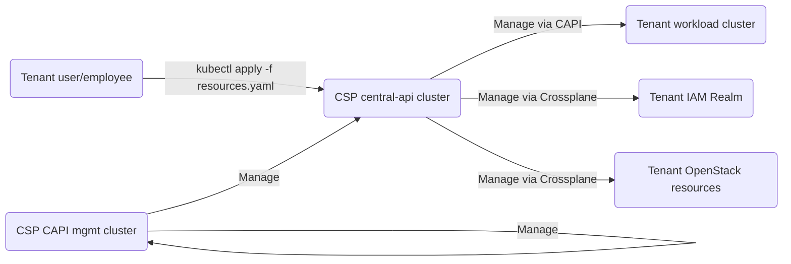

1. Bootstrap host in e. g. CSP hidden Openstack project, install kind+CAPI there (See CAPI ["Bootstrap & Pivot"](https://cluster-api.sigs.k8s.io/clusterctl/commands/move.html#bootstrap--pivot))

2. Use bootstrapping kind+CAPI to create Mgmt cluster in e. g. CSP hidden Openstack project using application credentials (See CAPI ["Bootstrap & Pivot"](https://cluster-api.sigs.k8s.io/clusterctl/commands/move.html#bootstrap--pivot))

3. Install CAPI on new mgmt cluster and `clusterctl move` resources from the bootstrapping cluster to new mgmt cluster, which should contain its own CAPI resources, then (See CAPI ["Bootstrap & Pivot"](https://cluster-api.sigs.k8s.io/clusterctl/commands/move.html#bootstrap--pivot))

4. Remove bootstrapping host (See CAPI ["Bootstrap & Pivot"](https://cluster-api.sigs.k8s.io/clusterctl/commands/move.html#bootstrap--pivot))

5. Use CAPI mgmt cluster to create central-api cluster (in e. g. CSP hidden Openstack project using application credentials)

6. Make all required changes to the central-api cluster to serve as central-api. This is where most automation will take care of placing credentials for the tenant's Openstack project (probably application credentials), for the tenant's keycloak realm (probably some client credentials) etc.

7. Actually make the central-api accessible to tenants, to manage their resources

