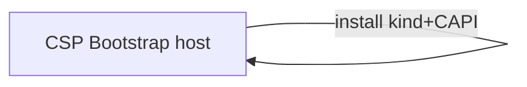
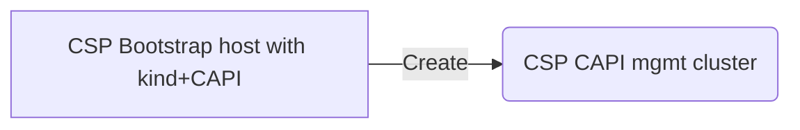
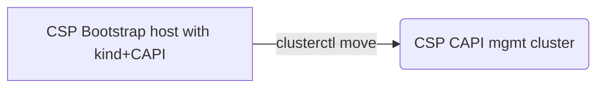
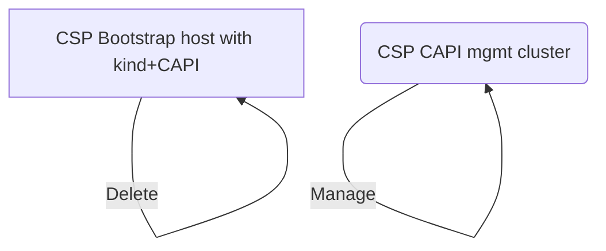
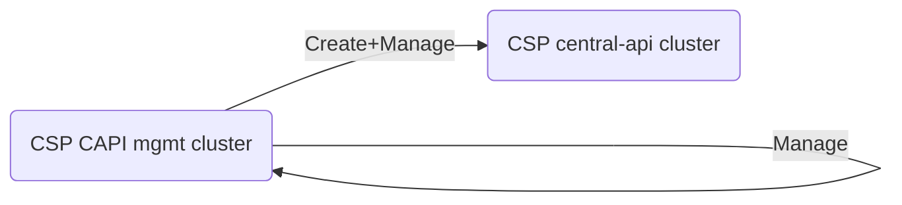
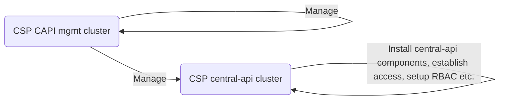
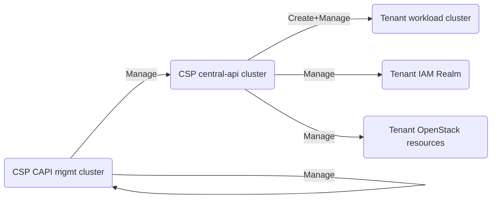

1. Bootstrap host in e. g. CSP hidden tenant, install kind+CAPI there

2. Use bootstrapping kind+CAPI to create Mgmt cluster (in e. g. CSP hidden tenant)

3. `clusterctl move` to new cluster, which should start managing itself

4. Remove bootstrapping host

5. Use CAPI mgmt cluster to create central-api cluster

6. Make all required changes to the central-api cluster to serve as central-api (this is where most automation will come in)

7. Actually make the central-api acessible to tenants, to manage their resources

